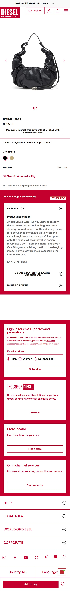
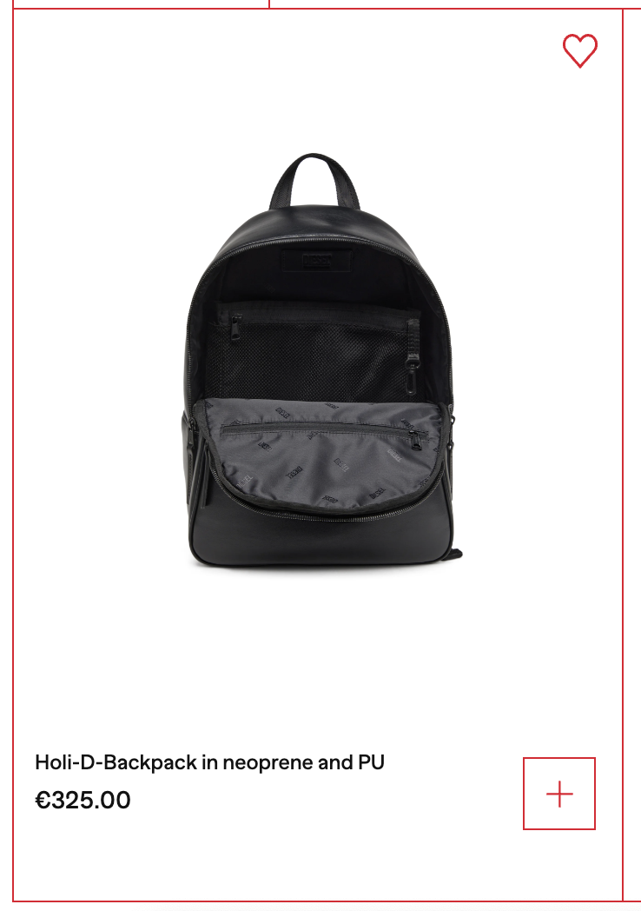

# Procesverslag
Markdown is een simpele manier om HTML te schrijven.  
Markdown cheat cheet: [Hulp bij het schrijven van Markdown](https://github.com/adam-p/markdown-here/wiki/Markdown-Cheatsheet).

Nb. De standaardstructuur en de spartaanse opmaak van de README.md zijn helemaal prima. Het gaat om de inhoud van je procesverslag. Besteedt de tijd voor pracht en praal aan je website.

Nb. Door *open* toe te voegen aan een *details* element kun je deze standaard open zetten. Fijn om dat steeds voor de relevante stuk(ken) te doen.

## Jij

  
uitwerken voor kick-off werkgroep

  ### Auteur:
  Zara Jones

  #### Je startniveau:
  De blauwe piste

  #### Je focus:
  Surface plane
 

## Je website

  
uitwerken voor kick-off werkgroep

  ### Je opdracht:
  https://nl.diesel.com/en/?utm_source=google&utm_medium=cpc&utm_campaign=LOWER_PURC_EMEA_NL-NL_ALW_ADW_BRAN_SRC_INTARGET--Pure+Brand_brand&utm_content=diesel--e&ds_cid=71700000035460485&gclsrc=aw.ds&gad_source=1&gad_campaignid=1396246797&gbraid=0AAAAADMWs7Xn2lmUPUNutB3iEz9LLRHSU&gclid=CjwKCAjwq9rFBhAIEiwAGVAZP0guP4KdLHHscahearVRAMV0zhnoVUWu-Dn_LT_rVKj9tujZMlAPShoCo3wQAvD_BwE

  #### Screenshot(s) van de eerste pagina (small screen): 
  Home pagina
  

  #### Screenshot(s) van de tweede pagina (small screen):
  Detailpagina 
  
 

## Toegankelijkheidstest 1/2 (week 1)

  
uitwerken na test in 2e werkgroep

  ### Bevindingen
  1. Bij de “+” zegt de screenreader alleen dat er een button is, niet wat het inhoudt.
  
  2.Er is geen goede alt tekst van de afbeeldingen, er wordt niet omschreven wat er op het plaatje staat. 
  Niet alle afbeeldingen hebben een alt. 
  3. Het is lastig voor mij om de screenreader te gebruiken en te begrijpen, omdat ik het zelf nog nooit gebruikt heb. Dus ik kan niet gemakkelijk door de website navigeren met de screenreader.
  4.

## Breakdownschets (week 1)

  
uitwerken na afloop 3e werkgroep

  ### de hele pagina: 
  

  ### dynamisch deel (bijv menu): 
  

## Voortgang 1 (week 2)

  
uitwerken voor 1e voortgang

  ### Stand van zaken
Deze week ben ik vooral bezig geweest met de html afmaken. Hiernaast ben ik ook begonnen met de css van mijn beginpagina, maar ik loop vaak vast bij dingen die mij niet lukken. Dan zit ik een uur dingen uit te proberen voor 1 ding, en dan lukt het uiteindelijk niet waardoor ik dan het oversla. 

Ik loop vooral vast bij de css. Ik vind het last om dingen te positioneren, bijvoorbeeld wanneer ik flex of grid moet gebruiken. 

  ### Eigen vragen:
- header?
- hoe zet ik andere dingen over een plaatje? --> plaatje als achtergrond
- 2e font?  franklin-gothic-compressed,sans-serif —> andere zoeken dat er op lijkt
- buttons footer kleur?

  ### Verslag van meeting
  hier na afloop snel de uitkomsten van de meeting vastleggen
- Een section moet een heading hebben
- Aria-label
- Figure tag —> alleenstaande foto’s
- Nav
- footer h4 —> h2
- grid of z-index
- Voor de form id gebruiken?

## Voortgang 2 (week 3)

  
uitwerken voor 2e voortgang

  ### Stand van zaken
Ik ben vooral bezig geweest met de header en footer afmaken. Ik liep hier enorm vast, omdat ik soms gewoon niet weet welke properties ik moet gebruiken. Hierdoor maak ik het veel te moeilijk voor mijzelf. 

  ### Eigen vragen:
- Border header, hoe?
- buttons footer kleur
- Hoe buttons in het midden?
- Footer section 2 achtergrond wit?
- Opdrachten als bron aangeven?
- Hoe kan ik meerdere sections in 1x selecteren
- Hoe krijg ik de woorden in een list meer naar rechts?

https://chrome.dev/carousel-configurator/

Button, link, link, button van maken
Nav van maken met <ul> <li> en <a>

Input email {
Appearance:none;
Border:none;
Border-bottom: solid 1px “kleur”;
}

Input mag in de <label> staan.

## Toegankelijkheidstest 2/2 (week 4)

  
uitwerken na test in 9e werkgroep

  ### Bevindingen
  Lijst met je bevindingen die in de test naar voren kwamen (geef ook aan wat er verbeterd is):

## Voortgang 3 (week 4)

  
uitwerken voor 3e voortgang

  ### Stand van zaken
  hier dit ging goed & dit was lastig (neem ook screenshots op van delen van je website en code)
  ### Eigen vragen
  Feedback 3:
Eigen vragen:
- Borders?
- Font
- Buttons Foster kleur
- Pijltje naast de H3 carrousel 2
- Scroll buttons carrousel?
- Video stylen?

  ### Verslag van meeting
  hier na afloop snel de uitkomsten van de meeting vastleggen

Border in carrousel:
ul {
Display: flex;
Background: rood;
Gap: 1px;
(Padding)
}

Li {
Background: wit;
}

Voor video:
https://developer.mozilla.org/en-US/docs/Web/Media/Guides/Audio_and_video_delivery

border: 1px var(--color-main) solid;

## Eindgesprek (week 5)

  
uitwerken voor eindgesprek

  ### Je uitkomst - karakteristiek screenshots:
  

  ### Dit ging goed/Heb ik geleerd: 
  Korte omschrijving met plaatjes

  

  ### Dit was lastig/Is niet gelukt:
  Korte omschrijving met plaatjes

  

## Bronnenlijst

  
continu bijhouden terwijl je werkt

  Nb. Wees specifiek ('css-tricks' als bron is bijv. niet specifiek genoeg). 
  Nb. ChatGpT en andere AI horen er ook bij.
  Nb. Vermeld de bronnen ook in je code.

  1. https://developer.mozilla.org/en-US/docs/Web/HTML/Reference/Elements/input/radio (radio buttons stylen/hoe je ze in een form moet aangeven)
  2. https://developer.mozilla.org/en-US/docs/Web/HTML/Reference/Elements/details
  3. Lesopdrachten: grid, hamburgermenu (javascript), animatie
  4. Chatgpt (alleen voor kleine dingen, zoals hoe ik makkelijker bepaalde tags moet selecteren in css, dus niet voor stukken code).
  5. https://chrome.dev/carousel-configurator/ (carousel)
  6. https://www.w3schools.com/howto/howto_js_toggle_dark_mode.asp (inspiratie voor javascript)
  7. https://chatgpt.com/share/691a2989-58b8-8000-a0da-f1280c668205 (Ik heb chatgpt gebruikt voor de scroll buttons)

